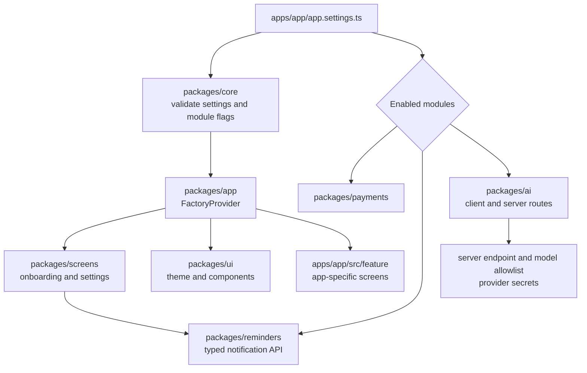

# rn-factory

A pnpm monorepo for small Expo apps. Each app combines one settings file with a
feature folder; shared packages provide the app shell, screens, UI, and optional
capabilities.

## How it fits together



`apps/template-app` is the source for new apps. Put app-specific behavior in
`apps/<app>/src/feature/`; keep `src/app/` route files small. The settings file
controls branding, fonts, privacy links, telemetry, and optional modules.
The shared Settings screen exposes one daily reminder with an editable time
and on/off switch through `@factory/reminders`. Apps that need more reminders
can build that experience in their own feature folder using the shared package
API. See [docs/ai.md](docs/ai.md) for the AI disclosure and OpenRouter free-model
data policy.
The AI module supports OpenAI, Anthropic, and an OpenAI-compatible provider.
Compatible base URLs and model names must match the server allowlist. Provider
credentials stay on the server.

App features use `FlatList` for short bounded lists and pagers, and `FlashList`
for long or growing feeds. FlashList v2 is included in the template for SDK 57;
see the [React Native skill](.claude/skills/react-native/SKILL.md#4-lists-choose-by-size-recycle-safely)
for recycling and profiling rules.

`FactoryProvider` also supplies the gesture root. Each app inherits SDK-compatible
Gesture Handler, Reanimated, and Worklets; gesture behavior stays in its feature
folder. See the [React Native skill](.claude/skills/react-native/SKILL.md#9-gestures-and-animation-stay-on-the-ui-thread)
for UI-thread updates, reduced motion, and accessible alternatives.

## Create and run an app

Use Node 22.18+ and pnpm 12.8.1.

```sh
pnpm install
pnpm new-app "My App"
pnpm --filter my-app start
```

`pnpm new-app` copies the template and prompts for missing settings. From the
repository root, run `pnpm typecheck` and `pnpm lint` to check the workspace.
For a device, install a development build first; see [Expo development
builds](https://docs.expo.dev/develop/development-builds/introduction/).

## Maestro flows

Install Maestro and Java 17+, connect one Android phone, then start the app's
development server. Run `pnpm maestro` for all shared flows or
`pnpm maestro settings` for one flow. **Flows clear app data on the connected
phone. Run them only when that phone is free.** See [docs/maestro.md](docs/maestro.md)
for setup, options, and flow details.

## Project map

| Path | Role |
| --- | --- |
| `apps/<app>/app.settings.ts` | App identity, branding, module flags, and service settings |
| `apps/<app>/src/app/` | Expo Router layout and route files |
| `apps/<app>/src/feature/` | App-specific screens and behavior |
| `apps/<app>/src/text/` | App translations |
| `apps/<app>/modules/` | App-owned Expo Modules API modules |
| `packages/core` | Settings schema, storage, and shared logic |
| `packages/app` | `FactoryProvider`, app settings, and translation hooks |
| `packages/screens` | Shared onboarding and settings screens |
| `packages/ui` | Theme tokens and reusable components |
| `packages/payments` | Optional RevenueCat integration and paywall |
| `packages/reminders` | Optional local notification reminder API |
| `packages/ai` | Optional AI client, provider routing, and server support |
| `docs/` | Decisions and capability guides |

See [docs/reminders.md](docs/reminders.md), [docs/ai.md](docs/ai.md),
[docs/payments.md](docs/payments.md), [docs/native-modules.md](docs/native-modules.md),
and [docs/maestro.md](docs/maestro.md) for capability details.

To capture frame timing and app CPU for one Maestro flow on an Android 12+
device, use `pnpm perf:maestro <flow>` with the app's standalone release build
installed. It runs the flow once without a dev server and writes a Perfetto
trace and JSON report under the ignored `maestro-screenshots/performance/`
folder. See [docs/performance.md](docs/performance.md).
